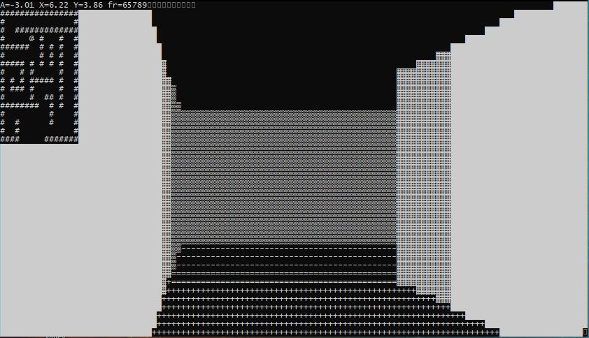

# Maze-Game

Basic maze game implemented in C++.

I was interested in developing my C++ skills a bit more, and have always loved games. I wanted to make a basic Wolfenstein-like renderer in the console, after
seeing someone else do a similar thing on YouTube.

## Features

Basic 3D rendering based on a 2D maze, with a minimap and fast refresh

## Note

Only works on Windows (uses the windows console APIs)
